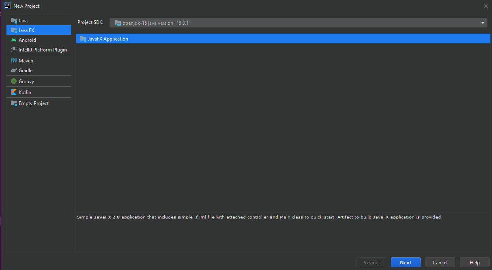
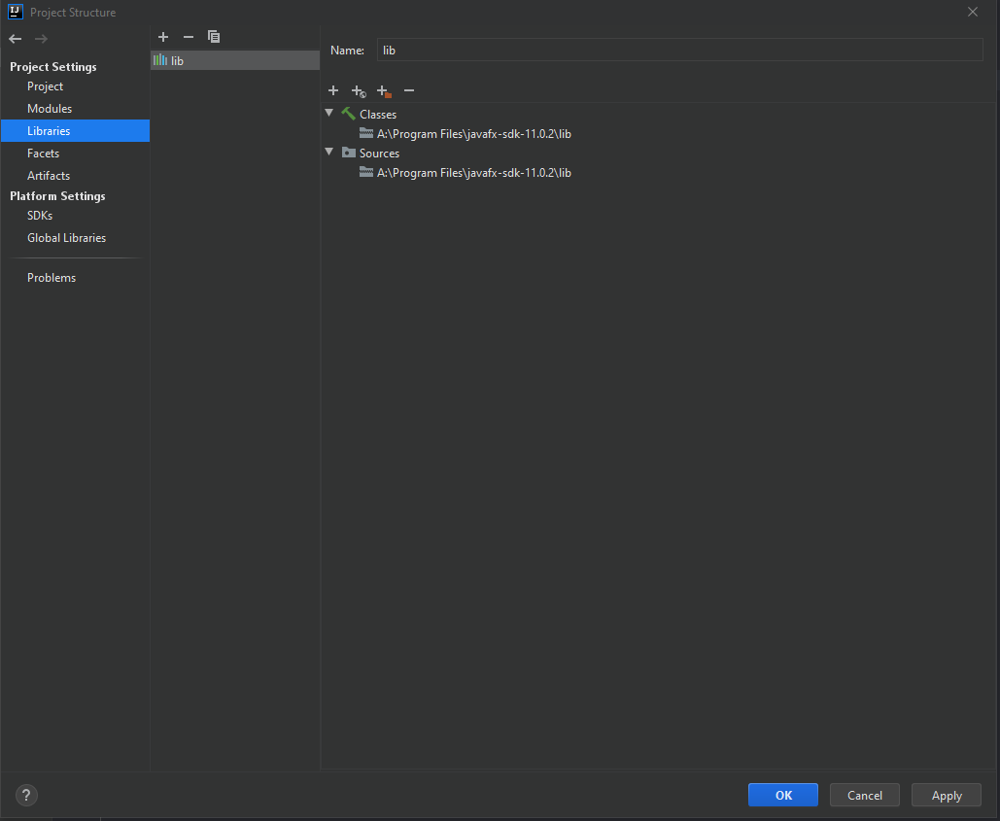
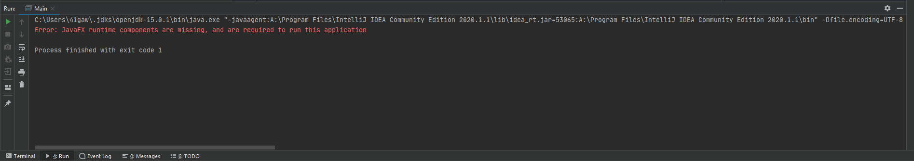
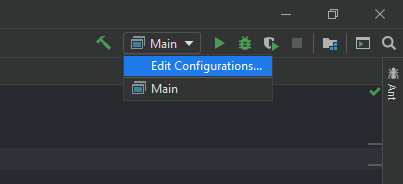
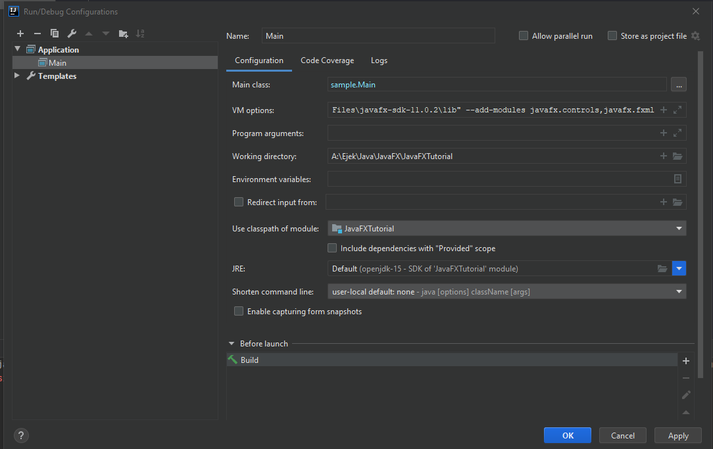
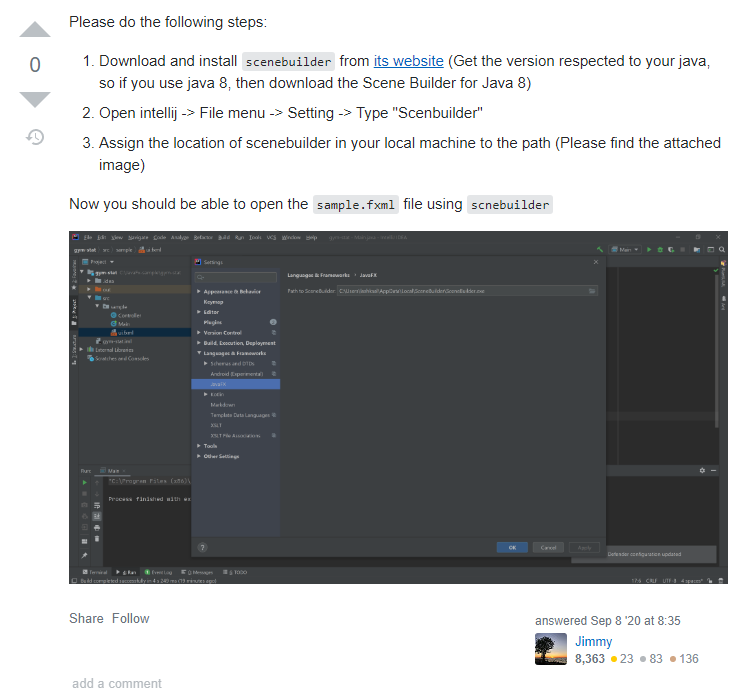

## JavaFX

File --> New --> Project

Projekt utworzony teraz trzeba dodać libke javaFX.

File --> Project Structure --> Libraries

Klikasz "+" i dodajesz folder **lib** z lokalizacji gdzie zainstalowałeś **javafx-sdk**.

No i teraz odpalamy ale nie działa

No bo trzeba dać do buildera odpowiednie componenty JavaFX, żeby je widział z tej libki

Czyli klikamy tu teges:

I kopiujesz taki tekst:

`--module-path "A:\Program Files\javafx-sdk-11.0.2\lib" --add-modules javafx.controls,javafx.fxml`

Czyli ścieżka do **lib** z folderu gdzie zainstalowano **javafx-sdk**.

i dodajemy moduły, z których będzie korzystane. Tu dodane są kontrolki i pliki fxml.

I takie tekst dajemy do VM options:

No i cykenes działa

## ScreenBuilder

https://stackoverflow.com/questions/53177828/failed-to-start-scene-builder

